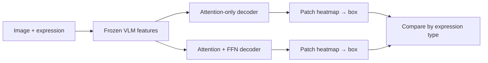

# Do Visual Grounding Decoders Need Feed-Forward Networks?

Can an FFN-free grounding decoder localize a language-referred object from frozen pretrained VLM features? Our completed study says: usually yes. At fixed decoder depth, removing FFNs preserves grounding performance on standard and adversarial evaluations; on controlled compositional grounding it creates a small deficit that is recovered by reallocating the parameter budget to attention depth.

Initial study: characterize where an FFN-free grounding decoder succeeds or fails. Given an image and expression, predict one bounding box; compare matched standard and attention-only decoders across retrieval-style and compositional references.



The claim is deliberately narrow: the **trainable decoder** is FFN-free; the frozen SigLIP2 and CLIP backbones retain their pretrained FFNs. Start with the [paper package](paper/README.md), [visual guide](docs/visual-guide.md), and [evidence map](docs/paper_findings.md).

## Result in one paragraph

Across three RefCOCOg seeds, A4 (four attention-only blocks) matched S4 (four attention-plus-FFN blocks). On Ref-Adv-s, A4 was slightly ahead (`+0.79 pp` IoU@0.5, 95% CI `[+0.06, +1.52]`). FineCops-Ref finally showed a small A4 deficit (`−0.52 pp`, 95% CI `[−0.95, −0.12]`), but A8, the parameter-matched eight-block attention-only decoder, recovered it (`+0.26 pp` versus S4). The official FineCops difficulty levels do not show a monotonic harder-means-more-FFN-needed pattern. A one-seed frozen-CLIP control also gave A4 ≈ S4. Full tables, plots, and limits are in [`docs/results/`](docs/results/) and [`docs/paper_findings.md`](docs/paper_findings.md).

Local invariant check (no model or dataset download):

```bash
python3 test_study.py
```

The experimental phase is frozen. The only post-run correction was a FineCops bootstrap/plot regeneration with the preregistered seed `20260812`; it reran no model or inference.

Run the local invariant check (no model or dataset download):

```bash
python3 test_study.py
```

For the manuscript assets and consistency check:

```bash
python3 scripts/generate_paper_assets.py
python3 scripts/verify_paper.py
```

See the [progress log](docs/progress-log.md), [decision log](docs/decision-log.md), and [completion audit](docs/completion-audit.md) for the frozen record.
