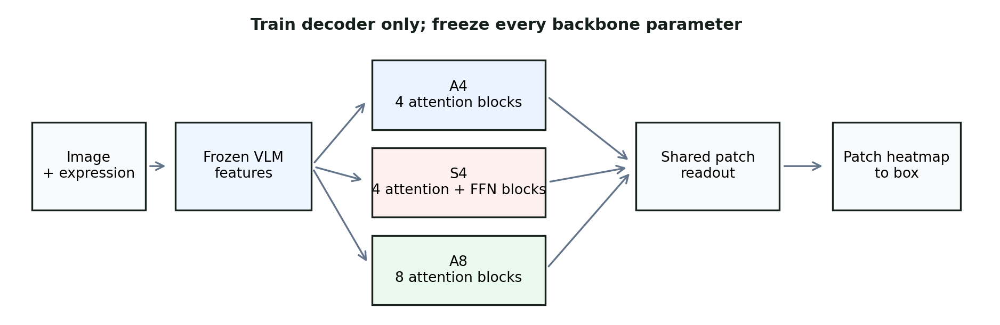
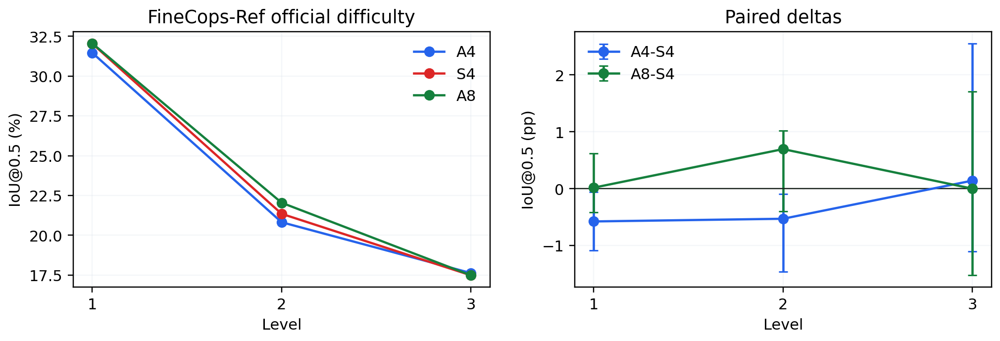

# Do Visual Grounding Decoders Need Feed-Forward Networks?

**A controlled study over frozen vision-language features**

[Paper PDF](paper/main.pdf) | [Research website](docs/index.html) | [LaTex source](paper/main.tex) | [Final status](research-docs/current_status.md)

This repository studies a narrow question: once a pretrained VLM has already encoded image and language context, can a small trainable grounding decoder omit token-wise feed-forward networks (FFNs) without losing its ability to localize a referred object?

## Result in One Paragraph

Across three RefCOCOg seeds, the four-block attention-only decoder (A4) matches the same-depth attention-plus-FFN decoder (S4). On the 1,142-example adversarial Ref-Adv-s evaluation, A4 is +0.79 percentage points (pp) over S4 at IoU@0.5, 95% CI [+0.06, +1.52]. FineCops-Ref finally reveals a small fixed-depth A4 deficit of -0.52 pp, 95% CI [-0.95, -0.12], but the eight-block attention-only control (A8) recovers it at +0.26 pp versus S4. Official FineCops difficulty levels do not show a monotonic harder-expression boundary. The defensible conclusion is that **FFNs are often dispensable in this small grounding decoder over frozen VLM representations; where a small compositional gap appears, reallocating the decoder parameter budget into attention depth recovers it.**

## How to Read the Decoder Names

- **Frozen VLM:** SigLIP2 or CLIP produces frozen image and contextual text features. The backbone retains its pretrained FFNs.
- **A4:** four attention-only decoder blocks. Each block has text and image cross-attention but no FFN residual.
- **S4:** the same four decoder blocks with a pre-normalized GELU FFN residual after each text/image attention pair.
- **A8:** eight attention-only decoder blocks. It approximately matches S4's trainable parameter count, but not its compute.
- **Grounding output:** one learned query reads the image patch tokens and produces one 24x24 patch heatmap, which a shared deterministic mass rule turns into one bounding box.
- **A4-S4:** the paired difference in IoU@0.5, reported in percentage points. A positive number favors A4.

The study does not test an attention-only VLM. It tests the new trainable grounding decoder over a frozen VLM.

## Exactly What the Decoder Learns

Given an image and referring expression, the frozen backbone returns image tokens I and text states T. Shared learned projections map both to width 256. A learned grounding query q alternates text and image cross-attention:

    q <- q + CrossAttentionText(LayerNorm(q), LayerNorm(T))
    q <- q + CrossAttentionImage(LayerNorm(q), LayerNorm(I))
    q <- q + FFN(LayerNorm(q))  # S4 only

The final query and image tokens produce a softmax-normalized patch distribution. Training minimizes cross-entropy against the target box's normalized patch-overlap distribution. There is no coordinate-regression MLP, segmentation refiner, auxiliary loss, multi-query head, or backbone fine-tuning.

The mass threshold tau = 0.8 was selected once on RefCOCOg validation and then frozen before held-out and out-of-distribution evaluation. All three-seed comparisons use 10,000 image-clustered paired bootstrap replicates with locked seed 20260812.

## Main Results

| Evaluation | A4-S4 IoU@0.5 | Interval | Reading |
| --- | ---: | --- | --- |
| RefCOCOg direct, three seeds | +0.26 pp | 90% CI [-0.33, +0.84] | Direct retention passes; the planned direct-minus-logical interaction is not confirmed. |
| Ref-Adv-s, three seeds | +0.79 pp | 95% CI [+0.06, +1.52] | No broad collapse on released negation, length, or distractor metadata. |
| FineCops-Ref, three seeds | -0.52 pp | 95% CI [-0.95, -0.12] | A small fixed-depth compositional gap appears. |
| FineCops A8-S4, three seeds | +0.26 pp | Paired estimate | Extra attention depth recovers the observed overall gap. |
| CLIP control, one seed | +0.18 pp | Descriptive only | Direction is not unique to the primary SigLIP2 backbone. |

## What the Results Mean

### RefCOCOg

A4 retains direct-reference performance on the primary three-seed dataset. The predeclared direct-minus-logical interaction is +1.30 pp with 95% CI [-0.09, +2.66], which does not confirm a retrieval-versus-reasoning failure boundary. This negative result matters: a directional difference without the planned interval support is not promoted to the main claim.

Both decoders depend on both modalities. Correct minus image-shuffle is +48.7 pp for A4 and +48.6 pp for S4; correct minus text-shuffle is +22.6 pp and +22.4 pp. The decoder is not simply reading one modality or a fixed position prior.

### Ref-Adv-s

The prepared 1,142-example Ref-Adv-s set is evaluation only: no model, threshold, slice, or visualization rule was selected on it. A4 is slightly ahead overall. The negation slice is -0.15 pp, the longest-expression quartile is +1.79 pp, and the highest-distractor quartile is 0.00 pp. These released metadata slices do not show attention-only performance falling monotonically as expressions become harder.

### FineCops-Ref

FineCops-Ref exposes the only clear fixed-depth A4 deficit: -0.52 pp overall. Its official level-1 and level-2 estimates are also modestly negative, while level 3 is +0.14 pp but imprecise. The result does not support a monotonic "harder means more FFN needed" narrative.

A8 is +0.26 pp against S4 overall. This supports a capacity-reallocation interpretation: at this decoder scale, the observed fixed-depth gap can be closed by more attention depth. It does not prove that FFNs never provide a distinct function, and A8 is not compute-matched.

### Efficiency

| Variant | Trainable decoder params | Cached decoder latency | Full pipeline latency |
| --- | ---: | ---: | ---: |
| A4 | 2.64M | 6.71 ms | 209.35 ms |
| S4 | 4.74M | 7.46 ms | 210.20 ms |
| A8 | 4.75M | 12.70 ms | 199.91 ms |

A4 removes 44.4% of S4's trainable decoder parameters and reduces cached-decoder latency by 10.1%. The full VLM dominates end-to-end timing, so the 0.4% full-pipeline difference is not the paper headline.

## Reproduce the Paper Assets

No GPU or model download is required. The command reads committed result artifacts and regenerates the paper table, PNG/PDF/SVG figures, machine-readable evidence manifest, static-site assets, and rendered review PDF.

    python3 -m venv .paper-venv
    .paper-venv/bin/pip install -r requirements-paper.txt
    make PYTHON=.paper-venv/bin/python submission

For the study-invariant checks:

    python3 test_study.py

For submission-source packaging:

    make overleaf-package
    make arxiv-package
    make arxiv-preflight

arxiv-preflight verifies archive contents, citations, inclusion paths, and source hygiene. A final clean TeX compilation remains a human-submission step on a machine with a complete TeX installation.

## Repository Map

    paper/                      Canonical LaTeX manuscript, review PDF, references, figures, tables
    docs/                       Static research page, extended working notes, and web assets
    docs/results/               Committed detailed result artifacts, per-example metrics, plots, bootstraps
    research-docs/              Final status, dataset card, and frozen evaluation protocol
    results/                    Release-facing result index and result-family summaries
    configs/                    Frozen decoder/evaluation contract and release artifact map
    decision-log/               Compact research and release decisions
    scripts/                    Paper-asset generation, PDF rendering, verification, source preflight
    study.py, run.py, analyze.py Core data/model/training/evaluation implementation
    test_study.py               CPU invariant tests

Start with the [paper package](paper/README.md), [final status](research-docs/current_status.md), [result index](results/README.md), and [claim boundary](paper/claims-and-limitations.md).

## Experimental Design

- **Primary backbone:** frozen SigLIP2 B/16 at 384px, yielding a 24x24 image-token grid.
- **Replication backbone:** frozen CLIP L/14 at 336px, also yielding a 24x24 grid.
- **Intervention:** delete only decoder FFN residuals at fixed width/depth for A4 versus S4.
- **Capacity control:** A8 reallocates the removed FFN parameter budget into attention-only depth.
- **Task:** one referring expression and image map to one target bounding box.
- **Primary evidence:** RefCOCOg UMD, three paired seeds.
- **Stress test:** Ref-Adv-s, three seeds, test-only metadata analysis.
- **Controlled test:** FineCops-Ref official positive test, three seeds, official fields only.
- **Uncertainty:** paired image-clustered bootstrap with frozen seed 20260812.
- **Controls:** D0, uniform, position prior, text shuffle, image shuffle, attention-depth, parameter, efficiency, classic-dataset, and second-backbone controls.

## Evidence Boundary

- FineCops results use the official positive-test set and released metadata; they are not a universal compositional-language benchmark.
- RefCOCO and CLIP controls are seed-0/one-seed descriptive evidence, not new multi-seed confirmation claims.
- The study does not establish segmentation, multi-object detection, backbone fine-tuning, or a fully attention-only VLM.
- Raw licensed images, pretrained weights, provider-local checkpoints, and unrecovered raw qualitative box exports are excluded from Git.
- The result does not justify retuning tau, checkpoint selection, model design, or slice boundaries on Ref-Adv-s or FineCops.

## Core Documentation

- [Current manuscript PDF](paper/main.pdf)
- [Canonical LaTeX source](paper/main.tex)
- [Claims and limitations](paper/claims-and-limitations.md)
- [Method contract](paper/method.md)
- [Writing guide](paper/writing-guide.md)
- [Citation audit](paper/citation-audit.md)
- [Data availability](paper/data-availability.md)
- [Submission checklist](paper/submission-checklist.md)
- [Dataset card](research-docs/dataset_card.md)
- [Frozen evaluation protocol](research-docs/frozen_evaluation_protocol.md)
- [Final research status](research-docs/current_status.md)
- [Primary three-seed result](docs/results/refcocog-three-seed-summary.md)
- [Ref-Adv-s analysis](docs/results/refadv/refadv_summary.md)
- [FineCops analysis](docs/results/finecops/finecops_summary.md)
- [Efficiency analysis](docs/results/efficiency/efficiency_table.md)

## Historical Record

The repository retains the original [progress log](docs/progress-log.md), [research log](docs/research-log.md), detailed [decision log](docs/decision-log.md), [GPU runbook](docs/gpu-runbook.md), and [completion audit](docs/completion-audit.md). These preserve both positive and negative outcomes, including why certain experiments were not expanded after the scientific question was already answered.
