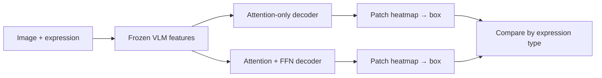

# Attention Is All You Need for VLMs

Can an attention-only grounding decoder localize a language-referred object from frozen pretrained VLM features?

Initial study: characterize where an FFN-free grounding decoder succeeds or fails. Given an image and expression, predict one bounding box; compare matched standard and attention-only decoders across retrieval-style and compositional references.



Start with the [visual guide](docs/visual-guide.md). The [evaluation contract](docs/evaluation.md) defines what would count as evidence before results exist. Project records live in [`docs/`](docs/), and the [GPU-readiness decision map](docs/decision-map.md) tracks every choice that must be resolved before training.

Local invariant check (no model or dataset download):

```bash
python3 test_study.py
```
