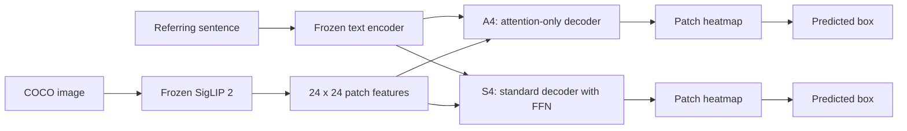
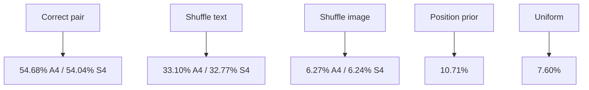

# Day 1 experiment summary

## The question

Can a small trainable grounding decoder over frozen VLM features remove its FFNs and still locate the object described by a sentence?

Example: the sentence `the lamb between the other lamb and the mother sheep` is paired with one ground-truth box. The decoder scores all 576 image patches, and the highest-mass region becomes the predicted box.

## What was completed

- Frozen SigLIP 2, RefCOCOg UMD, 80,512 train / 4,896 validation / 9,602 test expressions.
- A4 and S4 were trained for 5,000 updates at the predeclared learning rate `3e-4`.
- Heatmap-to-box mass `0.8` was selected from validation and frozen before test access.
- Seed-0 held-out evaluation and modality controls completed.

## Seed-0 test results

| Model | IoU@0.5 | Mean IoU | Pointing |
| --- | ---: | ---: | ---: |
| A4 attention-only | 54.68% | 49.19% | 79.94% |
| S4 standard + FFN | 54.04% | 48.88% | 79.64% |

This is a small A4 advantage, not evidence that FFNs are universally unnecessary. It needs seeds 1 and 2.

## Does the model use both modalities?

Both learned decoders lose substantially when text or image features are shuffled, and both beat the fixed priors. The result is therefore not explained by a position shortcut or by ignoring one modality.

## Task-type slices

The frozen analysis strata are direct, absolute, relational, logical, and unclassified. On seed 0, A4/S4 IoU@0.5 were:

| Stratum | A4 | S4 |
| --- | ---: | ---: |
| Direct | 56.98% | 56.49% |
| Absolute | 64.70% | 63.64% |
| Relational | 52.06% | 51.47% |
| Logical | 45.63% | 46.15% |

The logical difference is currently tiny. The proposed retrieval-versus-reasoning boundary is not established yet.

## Tomorrow

1. Finish seeds 1 and 2 and export their held-out predictions.
2. Run the locked paired image-clustered bootstrap analysis.
3. Add A8, the parameter-matched attention-only control, if the three-seed result remains informative.
4. Replicate the core comparison on RefCOCO+ and RefCOCO.
5. Run Ref-Adv-s only after all thresholds and taxonomy decisions remain frozen.

The main paper claim must remain: **FFN-free grounding decoder over frozen VLM features**, not “attention-only VLM.”
