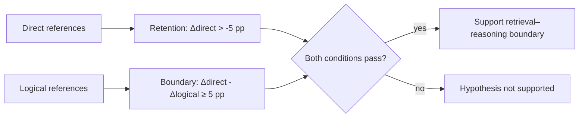

# Evaluation and analysis contract

Status: locked before implementation or test-set access

## Confirmatory question

The primary comparison is `A4` versus `S4` with SigLIP 2 on the RefCOCOg UMD test split, averaged over paired seeds `{0, 1, 2}`.

Let `Δ(stratum) = Acc@0.5(A4) - Acc@0.5(S4)`, measured in percentage points. The direct stratum contains only expressions with at most eight tokens and no detected structural cue; longer unmatched expressions are reported as `unclassified` and excluded from the confirmatory interaction.

Two predeclared conditions must both hold:

1. **Direct retention:** the lower bound of the 90% paired cluster-bootstrap confidence interval for `Δ(direct)` is above `-5 pp`.
2. **Task interaction:** the point estimate of `Δ(direct) - Δ(logical)` is at least `5 pp`, and its 95% paired cluster-bootstrap confidence interval excludes zero.

The five-point margin operationalizes “retains most accuracy.” Reaching only one condition is insufficient for the main claim.

## Metrics

| Level | Metric | Purpose |
| --- | --- | --- |
| Primary | box accuracy at IoU ≥ 0.5 | Standard referring-expression grounding outcome |
| Secondary | mean box IoU | Retains information hidden by the 0.5 threshold |
| Secondary | pointing accuracy | Whether the highest-probability patch center lies inside the target box |
| Secondary | target mass | Probability mass weighted by each patch's fraction inside the target box |
| Diagnostic | heatmap cross-entropy | Optimization and checkpoint selection only |
| Efficiency | trainable parameters, analytical MACs, peak VRAM, median latency | Prevent unsupported efficiency claims |

All metrics are reported overall, by exclusive stratum, and for predeclared multi-label slices. Expression length is analysed continuously and in training-derived quartiles.

## Uncertainty and dependence

- Bootstrap original image IDs rather than expressions because several expressions can share one image.
- Each of 10,000 replicates samples image IDs with replacement and retains every associated expression and all three paired seeds.
- Use bootstrap seed `20260812` and percentile intervals.
- Also report each training seed separately; the pooled interval cannot hide a seed with a reversed effect.
- Report RefCOCO testA/testB and RefCOCO+ testA/testB separately. Do not pool them.
- The two confirmatory conditions form one conjunctive claim. All other intervals and slices are descriptive; no secondary significance fishing.

## Capacity interpretation

`A8` decides whether attention depth can recover an `A4` deficit:

| Outcome on a stratum | Interpretation |
| --- | --- |
| `A4 ≈ S4` | FFNs are unnecessary under this task and decoder scale |
| `A4 < S4`, `A8 ≈ S4` | Removed capacity/depth explains the gap |
| `A4 < A8 < S4` | Attention depth helps but does not fully substitute |
| `A4 ≈ A8 < S4` | Evidence consistent with an FFN-specific advantage |

Here `≈` means within the same predeclared `5 pp` practical margin, not merely a non-significant difference.

## Interpretation gates

Before making an architectural claim:

1. `S4` must beat `D0` on logical references with a 95% paired cluster-bootstrap interval above zero. Otherwise the decoder itself has not demonstrated useful contextual computation.
2. Correct-pair `S4` and `A4` must each beat both their text-shuffle and image-shuffle evaluations overall, with 95% paired cluster-bootstrap intervals above zero. Otherwise the model may be ignoring a modality.
3. Learned models must beat the fixed position prior overall. Uniform and position priors remain visible in every result table.
4. Every paired run must pass the implementation invariants, use the same ordered example manifest, and complete the fixed update budget without non-finite values.

Failure of a gate makes the affected comparison inconclusive; it does not get repaired by changing thresholds after test evaluation.

## Selection boundary

- Choose the shared learning rate only through the predeclared RefCOCOg validation pilot.
- Select checkpoints by validation heatmap cross-entropy.
- Select heatmap-to-box mass `τ` once using RefCOCOg `S4` validation predictions.
- Freeze code, taxonomy version, checkpoint hashes, and `τ` before evaluating any test split.
- Ref-Adv-s is test-only. It cannot choose checkpoints, rules, thresholds, or plots.

## Reporting contract

Publish raw per-example predictions, bootstrap inputs, all seeds, failed runs, and negative outcomes. Report absolute accuracy beside every delta. A paper claim must describe the trainable component as an **FFN-free grounding decoder over frozen VLM features**, never an attention-only VLM.
