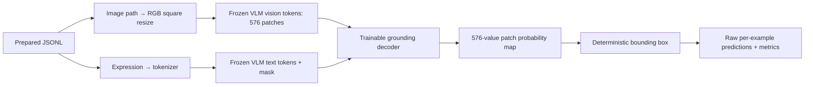

# GPU runbook

The GPU should start only after a machine with at least 32 GB VRAM and roughly 40 GB free disk is available. The classic COCO images are about 13 GB compressed and 13 GB extracted; checkpoints and model caches need the remaining space.

## What enters and leaves the model



## 0. Bootstrap

Run from the persistent data disk, never the 30 GB system disk:

```bash
cd /root/autodl-tmp
git clone https://github.com/TarunTomar122/attention-is-all-you-need-for-vlms.git
cd attention-is-all-you-need-for-vlms
python -m venv .venv
source .venv/bin/activate
python -m pip install --upgrade pip
python -m pip install --index-url https://download.pytorch.org/whl/cu128 torch==2.8.0
python -m pip install -r requirements.txt
python test_study.py
nvidia-smi
```

Expected local check:

```text
ok: taxonomy, data normalization, decoder, masks, gradients, geometry, and parameter match
```

Stop if this fails.

## 1. Acquire data once

Classic annotation archives are the verified Internet Archive captures referenced by the official Refer API maintainers. COCO images remain under COCO's terms.

```bash
mkdir -p data/archives data/annotations data/coco
curl -fL --retry 3 -o data/archives/refcoco.zip https://web.archive.org/web/20220413011718id_/https://bvisionweb1.cs.unc.edu/licheng/referit/data/refcoco.zip
curl -fL --retry 3 -o data/archives/refcoco+.zip https://web.archive.org/web/20220413011656id_/https://bvisionweb1.cs.unc.edu/licheng/referit/data/refcoco+.zip
curl -fL --retry 3 -o data/archives/refcocog.zip https://web.archive.org/web/20220413012904id_/https://bvisionweb1.cs.unc.edu/licheng/referit/data/refcocog.zip
printf '7f924bb7ed8dc4568058e4ff626281918d56e5206f4c868c5a80f088f38c8bf0  data/archives/refcoco.zip\n5f1238112d63199e68da54a28f201471909b21ded7ed79a57d51b4c1443c6b45  data/archives/refcoco+.zip\n3d1f7e5b2ff2205940bf59de55f861f5f2cc1403fb980669933a7f9af1aa8211  data/archives/refcocog.zip\n' | sha256sum -c -
unzip -q data/archives/refcoco.zip -d data/annotations
unzip -q data/archives/refcoco+.zip -d data/annotations
unzip -q data/archives/refcocog.zip -d data/annotations
curl -fL --retry 3 -o data/archives/train2014.zip http://images.cocodataset.org/zips/train2014.zip
printf '0da8c0bd3d6becc4dcb32757491aca88  data/archives/train2014.zip\n' | md5sum -c -
unzip -q data/archives/train2014.zip -d data/coco
```

The three printed SHA-256 values must exactly match [datasets.md](datasets.md). Archives may then be moved to trash if disk is tight.

## 2. Build isolated manifests

```bash
python prepare_classic.py --dataset refcocog --split train --instances data/annotations/refcocog/instances.json --refs 'data/annotations/refcocog/refs(umd).p' --images data/coco/train2014 --output data/refcocog-train.jsonl
python prepare_classic.py --dataset refcocog --split val --instances data/annotations/refcocog/instances.json --refs 'data/annotations/refcocog/refs(umd).p' --images data/coco/train2014 --output data/refcocog-val.jsonl
python prepare_classic.py --dataset refcocog --split test --instances data/annotations/refcocog/instances.json --refs 'data/annotations/refcocog/refs(umd).p' --images data/coco/train2014 --output data/refcocog-test.jsonl
```

Repeat with `refs(unc).p` and official split names `train`, `val`, `testA`, `testB` for RefCOCO and RefCOCO+. Never combine manifests across datasets.

Only after the whole experiment is frozen:

```bash
python prepare_refadv.py --output data/refadv-test.jsonl
```

## 3. Mandatory CUDA smoke run

This is the first GPU action. It exercises one complete update and validation pass using 64 training and 32 validation expressions:

```bash
python run.py train --train data/refcocog-train.jsonl --val data/refcocog-val.jsonl --output runs/smoke-a4 --variant A4 --seed 0 --learning-rate 3e-4 --batch-size 32 --accumulate 2 --steps 2 --warmup-steps 1 --eval-every 1 --limit-train 64 --limit-val 32
```

- exactly 576 image patches;
- finite train and validation loss;
- `best.pt` and `metadata.json` exist;
- `git_commit`, manifest hashes, model revision, parameter counts, CUDA version, and GPU name are present;
- `nvidia-smi` reports safe memory headroom.

Delete or archive the smoke run before starting the pilot. If batch 32 does not fit, preserve global batch 64 by reducing `--batch-size` and increasing `--accumulate`; log this once.

## 4. Shared learning-rate pilot

Run `A4` and `S4`, seed 0, for 500 updates at each rate:

```bash
for lr in 1e-4 3e-4 1e-3; do
  for variant in A4 S4; do
    python run.py train --train data/refcocog-train.jsonl --val data/refcocog-val.jsonl --output "runs/pilot-${variant}-${lr}" --variant "$variant" --seed 0 --learning-rate "$lr" --steps 500 --warmup-steps 25 --eval-every 500
  done
done
```

Choose the rate with the lowest mean final validation loss across `A4` and `S4`; break an exact tie toward the smaller rate. Append the decision and six losses to the decision/progress logs and push before final runs.

## 5. Primary matrix

Substitute the frozen rate for `$LR`:

```bash
for seed in 0 1 2; do
  for variant in D0 A1 A2 A4 S1 S2 S4 A8; do
    python run.py train --train data/refcocog-train.jsonl --val data/refcocog-val.jsonl --output "runs/refcocog-siglip2-${variant}-s${seed}" --variant "$variant" --seed "$seed" --learning-rate "$LR"
  done
done
```

Then run the core matrix `D0 A4 S4 A8` separately on RefCOCO+ and RefCOCO. CLIP replication is last and uses RefCOCOg only with `--backbone clip`.

## 6. Select the one box mass and evaluate

First export RefCOCOg validation heatmaps for `S4`, seed 0 at an arbitrary valid mass; mass selection recomputes all candidate boxes from raw heatmaps:

```bash
python run.py evaluate --checkpoint runs/refcocog-siglip2-S4-s0/best.pt --data data/refcocog-val.jsonl --output runs/refcocog-siglip2-S4-s0/val.pt --mass 0.5
python select_mass.py runs/refcocog-siglip2-S4-s0/val.pt
```

Record the selected value as `$MASS`, commit it, then export every in-domain test prediction:

```bash
python run.py evaluate --checkpoint runs/refcocog-siglip2-A4-s0/best.pt --data data/refcocog-test.jsonl --output runs/refcocog-siglip2-A4-s0/test.pt --mass "$MASS"
```

Repeat for all seeds and variants. Run Ref-Adv-s last using only RefCOCOg checkpoints. Never overwrite prediction files.

Export modality and fixed-prior controls before interpretation:

```bash
python run.py evaluate --checkpoint runs/refcocog-siglip2-A4-s0/best.pt --data data/refcocog-test.jsonl --output runs/refcocog-siglip2-A4-s0/test-text-shuffle.pt --mass "$MASS" --control text-shuffle
python run.py evaluate --checkpoint runs/refcocog-siglip2-A4-s0/best.pt --data data/refcocog-test.jsonl --output runs/refcocog-siglip2-A4-s0/test-image-shuffle.pt --mass "$MASS" --control image-shuffle
python baseline.py --kind uniform --data data/refcocog-test.jsonl --output runs/refcocog-uniform.pt --mass "$MASS"
python baseline.py --kind position-prior --train data/refcocog-train.jsonl --data data/refcocog-test.jsonl --output runs/refcocog-position-prior.pt --mass "$MASS"
```

Repeat both modality shuffles for `A4` and `S4` across all three seeds.

## 7. Confirmatory analysis

```bash
python analyze.py \
  --attention runs/refcocog-siglip2-A4-s0/test.pt runs/refcocog-siglip2-A4-s1/test.pt runs/refcocog-siglip2-A4-s2/test.pt \
  --standard runs/refcocog-siglip2-S4-s0/test.pt runs/refcocog-siglip2-S4-s1/test.pt runs/refcocog-siglip2-S4-s2/test.pt \
  > runs/confirmatory.json
```

Do not summarize the main claim until the modality, position-prior, and `S4 > D0` interpretation gates in [evaluation.md](evaluation.md) have also been evaluated.

## Resume and stop rules

- A completed run is immutable. Resume by rerunning only if no final checkpoint exists; the current minimal runner intentionally fails rather than silently overwrite partial results.
- Stop the GPU after each bounded batch of runs. Push code and logs; store checkpoints/predictions on the persistent data disk and back up irreplaceable outputs separately.
- Stop the entire experiment on non-finite loss, manifest-hash mismatch, unexpected patch count, missing modality-control effect, or validation/test contamination.
