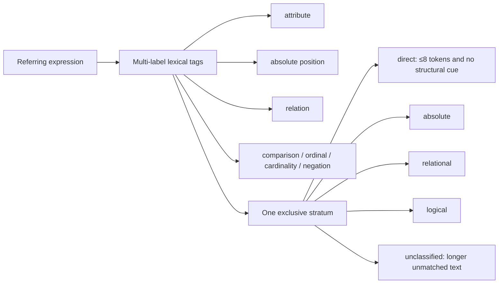

# Task taxonomy

The taxonomy is a **frozen analysis lens**, not an input to the model and not a claim about the hidden reasoning required by every example.

## Two labels per expression



Tags preserve overlap; the stratum supplies one clean bucket for plots and statistical comparisons.

## Assignment rule

The exclusive stratum uses this fixed priority:

```text
logical cue present                         -> logical
otherwise, relation cue present             -> relational
otherwise, absolute-position cue present    -> absolute
otherwise, token count ≤ 8                  -> direct
otherwise                                   -> unclassified
```

Examples:

| Expression | Tags | Stratum | Compositional? |
| --- | --- | --- | --- |
| `the dog` | none | direct | no |
| `the red cup` | attribute | direct | no |
| `person in the background` | absolute | absolute | no |
| `cup next to the laptop` | relation | relational | no |
| `second person from the right` | ordinal | logical | no |
| `smaller pot in front of the pan` | comparison, relation | logical | yes |
| `person not holding anything` | negation, relation | logical | yes |

`compositional = true` when an expression contains at least two structural cue types, or at least two relation mentions. Attribute words alone do not make an expression compositional.

`unclassified` is an honest abstention bucket. It is reported overall but excluded from the confirmatory direct-versus-logical interaction. The eight-token boundary was added after the training-only audit showed that long unmatched expressions often contained relations absent from the conservative lexicon.

## What is deliberately measurable

- Rules use normalized words and fixed phrases only; they do not inspect images, target boxes, predictions, or test results.
- Expression length is recorded as token count and analysed continuously. Plot bins are quartiles computed on each dataset's **training split**, then frozen.
- Ref-Adv-s native negation and distractor fields remain separate diagnostic labels. They can audit the lexical rules but cannot tune them.
- Every result is reported both overall and by exclusive stratum. Multi-label slices answer narrower questions such as negation or counting.

## Freeze and audit protocol

1. Implement the rules from this document.
2. Sample 40 RefCOCOg training expressions per predicted stratum with seed `20260812`.
3. Manually inspect the sampled expressions, record systematic failure modes, and publish the frozen sample.
4. Correct systematic lexical mistakes using only that training audit; add an abstention bucket if reliable assignment is impossible.
5. Version and freeze the rules before loading validation, test, or Ref-Adv-s expressions.

This keeps the taxonomy auditable without pretending a heuristic is ground-truth cognition. The executable boundary cases live with the implementation and must pass before any experiment.

## Completed training audit

The deterministic audit is published as [`taxonomy-audit.csv`](taxonomy-audit.csv). It contains 40 sampled RefCOCOg training expressions in each of the five final strata.

Observed systematic errors and corrections:

| Training-only audit finding | Frozen correction |
| --- | --- |
| `with` and `wearing` marked ordinary appearance descriptions as relations | Removed both broad triggers; retained explicit object relations such as `beside`, `behind`, `holding`, and `riding` |
| Every numeral marked jersey numbers and license plates as counting | Suppressed identifier contexts and number-letter strings |
| Plain `left` / `right` confused body parts and orientation with image position | Restricted absolute position to bounded phrases such as `on the left`, `right side`, and corners |
| `top` / `bottom` confused object parts with image position | Kept corner phrases and unambiguous `topmost` / `bottommost`; removed bare `top` / `bottom` tags |
| Long unmatched text often contained missed relations | Restricted `direct` to at most eight tokens and introduced `unclassified` abstention |

After this audit, taxonomy logic is version `v1` and frozen. Validation, test, and Ref-Adv-s expressions have not been loaded.
