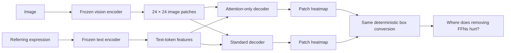
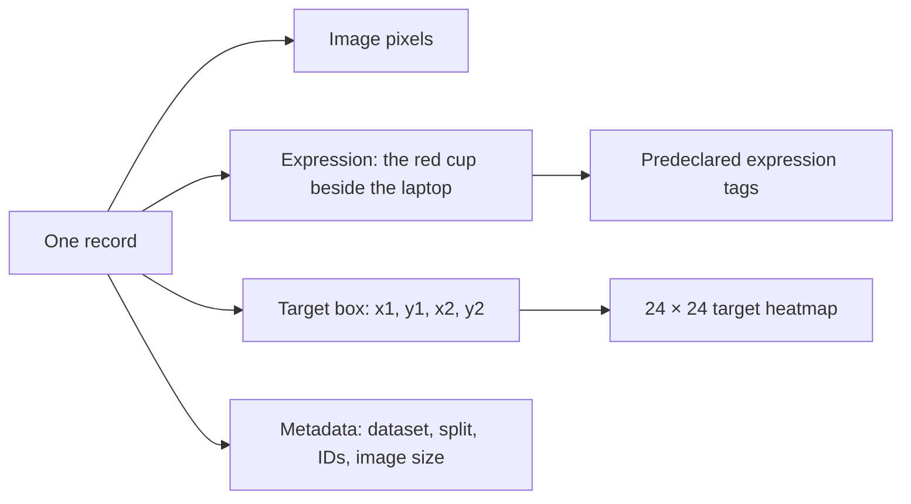
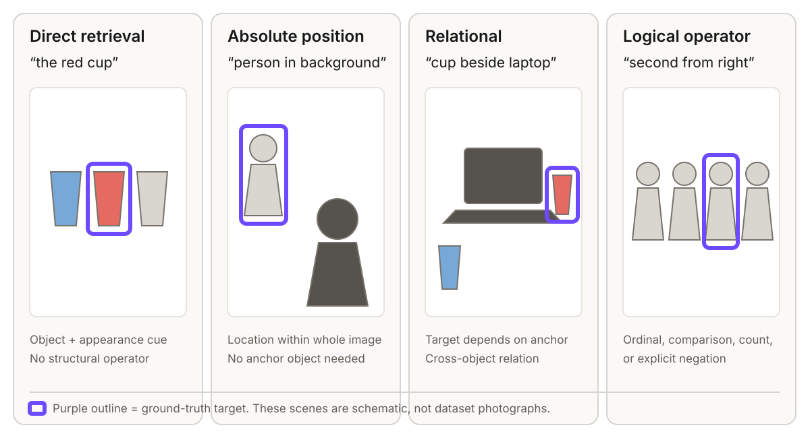
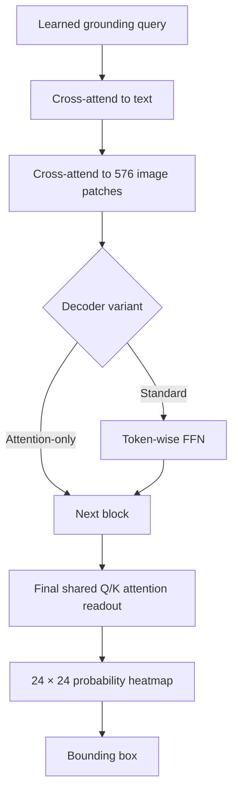
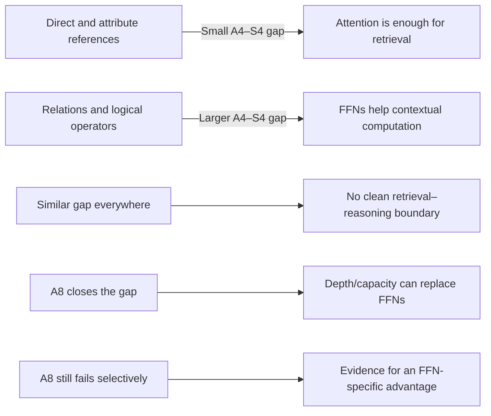
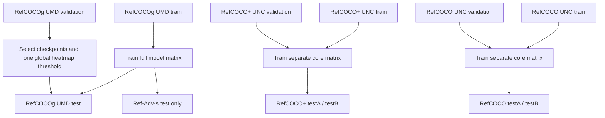

# Visual guide

## The question in one picture



The frozen encoders are identical within a comparison. Only the small grounding decoder changes.

## What one dataset example contains



Conceptually, the normalized record looks like:

```json
{
  "id": "refcocog:12345",
  "image": "COCO_train2014_000000123456.jpg",
  "width": 640,
  "height": 480,
  "expression": "the red cup beside the laptop",
  "box_xyxy": [410.0, 220.0, 458.0, 306.0],
  "tags": ["attribute", "relation"],
  "stratum": "relational",
  "compositional": false
}
```

The tags and stratum are analysis metadata. They are never supplied to the model.

## Expression types inside the datasets



These are primarily **types of expressions within each dataset**, not four separate datasets. The datasets emphasize different parts of the spectrum:

The exact deterministic assignment and audit procedure are in the [task taxonomy](task-taxonomy.md).

| Dataset | What its examples tend to test | How we use it |
| --- | --- | --- |
| RefCOCOg | Longer descriptions and more composition | Main study and complete depth sweep |
| RefCOCO+ | Appearance and relations without absolute location words | Tests whether attention-only works without easy left/right shortcuts |
| RefCOCO | Shorter classic references, including location cues | Legacy replication and comparison with prior work |
| Ref-Adv-s | Hard distractors, long expressions, negation and ordinal/comparative language | Test-only stress benchmark |

## Architecture comparison

Both models carry one learned grounding query. It repeatedly reads the frozen text and image tokens.



The standard model gets an FFN after every block. The attention-only model deletes exactly those FFNs. The final readout, supervision, preprocessing and box conversion remain identical.

## What success and failure look like



The experiment remains useful if the expected boundary does not appear; that outcome rejects the hypothesis rather than being hidden.

## Dataset flow and leakage boundary



The classic datasets reuse COCO images, so their training sets are never merged. Ref-Adv-s is never used for tuning.
